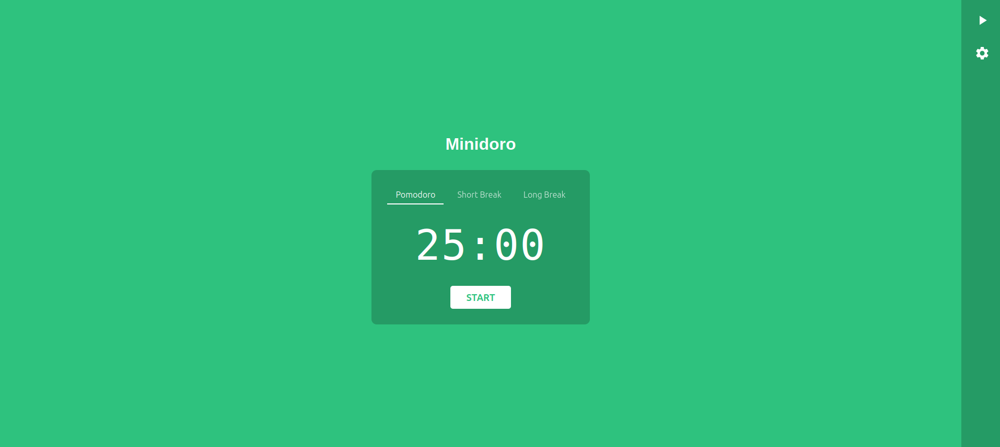

# Minidoro 🍅

[](VERSION)
[](https://github.com/PPeitsch/minidoro/actions)
[](https://codecov.io/gh/PPeitsch/minidoro)
[](https://opensource.org/licenses/MIT)
[](https://www.python.org/downloads/)
[](https://github.com/psf/black)
[](https://makeapullrequest.com)

A minimalist Pomodoro timer web application built with Flask. Simple, clean, and distraction-free focus timer with customizable themes and layouts.



## ✨ Features

- 🕒 25/5/15 minutes Pomodoro technique timer
- 🎨 Clean, minimalist interface
- 🎯 Customizable theme colors
- 🔄 Invertible layout
- 📱 Responsive design
- 🔔 Browser notifications
- 🔊 Sound alerts

## 🚀 Installation

1. Clone the repository
```bash
git clone https://github.com/PPeitsch/minidoro.git
cd minidoro
```

2. Create a virtual environment
```bash
python -m venv venv
source venv/bin/activate  # On Windows use: venv\Scripts\activate
```

3. Install dependencies
```bash
pip install -r requirements.txt
```

4. Run the application
```bash
python run.py
```

5. Open your browser and navigate to `http://localhost:5000`

## 🖥️ Usage

- Click the play button or "START" to begin a timer
- Use the tabs to switch between Pomodoro, Short Break, and Long Break
- Use the settings icon to customize theme color and layout
- Allow browser notifications for timer completion alerts

## 🧪 Testing

Install the test dependencies and run the tests:
```bash
pip install -r requirements-dev.txt
pytest tests/ -v --cov=app
```

Current test coverage: 95%+

## 🤝 Contributing

Contributions are welcome! Please read our [Contributing Guidelines](.github/CONTRIBUTING.md) first.

1. Fork the repository
2. Create your feature branch (`git checkout -b feature/AmazingFeature`)
3. Commit your changes (`git commit -m 'Add some AmazingFeature'`)
4. Push to the branch (`git push origin feature/AmazingFeature`)
5. Open a Pull Request

## 📝 License

MIT License - see the [LICENSE](LICENSE) file for details

## 📊 Project Status

- ✅ Core timer functionality
- ✅ Theme customization
- ✅ Notification system